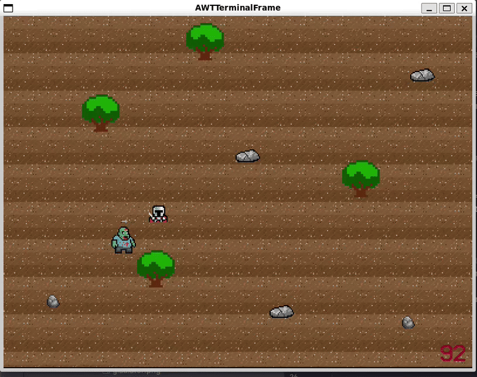
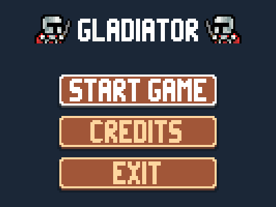
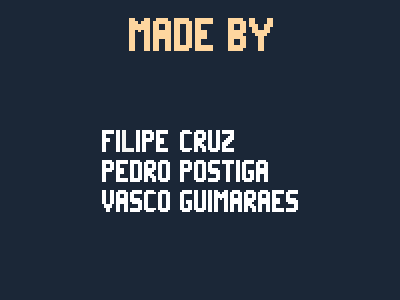
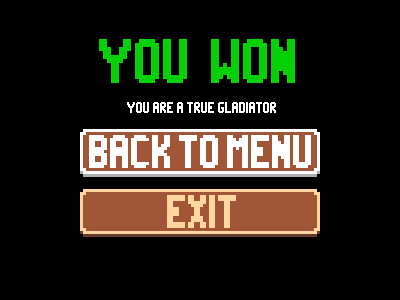
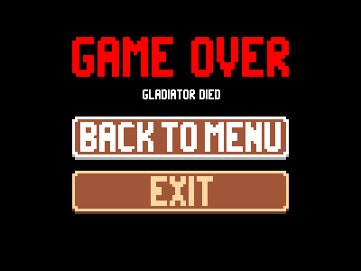

# LDTS_T02G02 - Gladiator

## Game Description

Gladiator is a 2D combat arena game where you play as a legendary gladiator fighting for glory and survival.
Battle through progressively challenging waves of enemies that will make your life no easy. Can the Gladiator
overcome the arena's challenges and survive to tell his tale, or will this be his end ?

This project was developed by Filipe Cruz (up202404158), Pedro Postiga (up202404966) and Vasco Guimarães (up202403604).

For a more detailed version of this description click [here](./docs/README.md).

## Screenshots

### Game Preview

  

### Menus

  

  <b><i>Fig 1. Main Menu </i></b>

  

 
 

  

  <b><i>Fig 2. Credits Screen </i></b>  

  

 
 

  

  <b><i>Fig 3. Win Menu </i></b>  

  

 
 

  

  <b><i>Fig 4. Lose Menu </i></b>  

