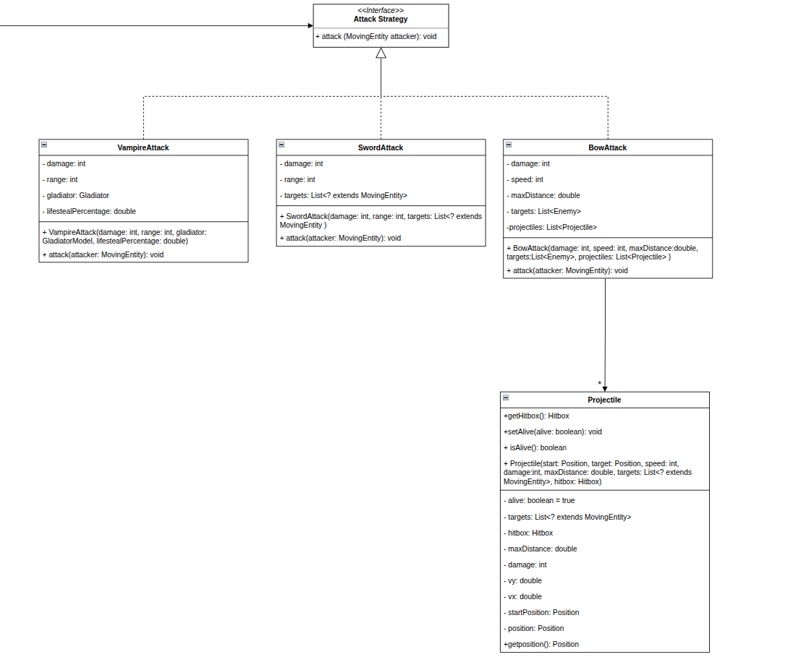
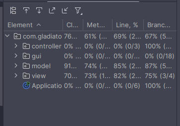

# LDTS_T02G02 - Gladiator 

## 🎯 About the game

 Gladiator is a 2D combat arena game where you play as a legendary gladiator fighting for glory and survival. 
Battle through progressively challenging waves of enemies, which will make your path to the final objective more 
difficult. The final objective is defeat the final boss, that will provide you an epic battle.

## Authors
 
 This project was developed by Filipe Cruz (up202404158), Pedro Postiga (up202404966) and Vasco Guimarães (up202403604).

## Implemented Features

    • Attacks - Diferent kind of attacks, each character have their own type of attack.
    • Enemies - Diferent type of enemies, behaving differently from one another.
    • Movement - Two types of movement, one random and one that chases the gladiator.

## Planned Features
    
    • Multiple Waves – The game features wave-based combat where different enemy types appear as the waves progress.
    • Bosses - Along the game fight strong enemies at the end of a wave.
    • Multiple Arenas - Along the game the gladiator should fight in different arenas. 

## Design
### MVC
#### Problem in context
Separate the data, interface and control of the game to have a more code reusability and to make the code more organized
and easy to implement. Without this pattern, the Single Principle Resposability could be broken, as a part of any of the 
MVC parts coulb be implemented on another.

#### The Pattern
The MVC pattern is a way to separate all the code in three elements, Model, View and Control. The Model does not have 
dependences, the View depends on the Model, and the Controller depends on both the Viewer and Model.

#### Implementation
The main source directory of the project has three directories that represent one of the MVC elements, they are:
[Model](/src/main/java/com.gladiator/model)
[View](/src/main/java/com.gladiator/view)
[Controller](/src/main/java/com.gladiator/controller)

#### Consequences
Front-end and back-end can be done simultaneously, and relacted actions are grouped making the code more organized.
The program is easy to modify and to test because the three elements are isolated from each other.

### Strategy Pattern
#### Problem in context
The game needed to support multiple types of attacks and movement behaviors for different entities.
#### The Pattern
The strategy pattern was selected because it defines a family of algorithms (attacks, movements), encapsulates each 
algorithm and makes algorithms interchangeable and fits the game's need for flexible combat and movement systems where 
entities can have different behaviors that may change during gameplay.
#### Implementation

#### Consequences
The pattern ensures easy extensibility, runtime flexibility, clean separation of concerns, and isolated 
testability. Besides that make easy the extension of new attacks and permit isolated testing.
### Factory Method
### Problem in context
The game needed a flexible way to create different types of arenas with specific enemy configurations. Hard-coding 
arena creation would make it difficult to create different arena variations or extend the game with new arena types.
### The Pattern
The factory pattern is a solution for those problems. With a single instance of the factory class, it become possible
to create the objects we desire with predifined parameters without needing to type it repeatdly. Also, if we didn't 
want to change the code (obeying the open-closed solid principle) we could just create another method for the class 
applying this design without needing to change the code.

### Implementation
The Factory Method Pattern is used in ArenaBuilder where the createArena(), createEnemies(), and createGladiator() 
methods act as factory methods that can be overridden by subclasses to create different variations.

### Consequences
Flexible Creation, Encapsulation and Extensibility: Subclasses can override factory methods to create different arena 
configurations while centralizing creation logic and enabling easy creation of new arena types.
## Testing

## Self-Evaluation
    - Filipe Cruz: 33%
    - Pedro Postiga: 33%
    - Vasco Guimarães: 33%
    

