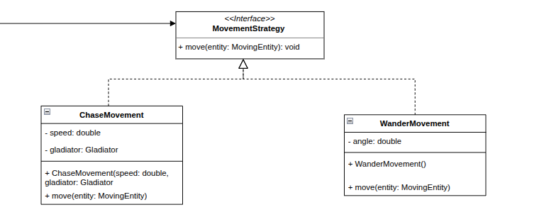
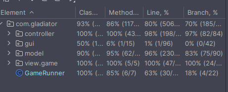
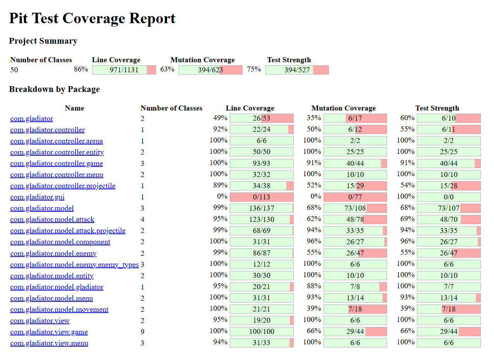

# LDTS_T02G02 - Gladiator 

## 🎯 About the game

 Gladiator is a 2D combat arena game where you play as a legendary gladiator fighting for glory and survival. 
Battle through progressively challenging waves of enemies that will make your life no easy. Can the Gladiator
overcome the arena's challenges and survive to tell his tale, or will this be his end ? 

## Authors
 
 This project was developed by Filipe Cruz (up202404158), Pedro Postiga (up202404966) and Vasco Guimarães (up202403604).

## Features

    • Main Menu Screen - Simple but appealing menu screen when launching the game, which allows the user to choose between
    starting the game, the credits menu or exiting the application. If you want to quit mid game, you can press Q to go to
    the menu screen.
    • Credits Menu Screen - Easy to access menu where all the game creators names are displayed.
    • Game Over Screen - When the Gladiator's health reaches zero, it dies and the lose menu is displayed. If the Gladiator
    can survive all 5 waves of enemies, the win menu is displayed.
    • Enemies - Diferent type of enemies, behaving differently from one another. Each one having their own type of attack.
    Being these attacks used automatically when an enemy is in range.
    • Enemy Movement - Two types of movement, one random and one that chases the gladiator.
    • Gladiator Movement - The Gladiator can move using arrow keys. All the Gladiator's movement and attack animations change
    according to the Gladiator's current direction.
    • Gladiator Attacks - The Gladiator has a close range attack, similar to the ones enemies have, but also has a long range
    attack, no one else have, that deals less damage. These attacks are used automatically too, when in range.
    • Sprite Image Loader - Class that loads PNG images into the game and can then represent them pixel by pixel on the screen,
    using Lanterna. 
    This is used for the Gladiator, enemies, arena background and obstacles.
    • Health - Gladiator has a health ammount, which is shown in the bottom right corner of the arena. The health decreases when
    the Gladiator is attacked by an enemy.
    • Waves - The Gladiator has to survive 5 waves of enemies. After killing all enemies from 1 wave, the next one comes stronger
    with more enemies to fight, having ,since the 3rd wave, one more enemy type to fight.

## Design
### MVC
#### Problem in context
Separate the data, interface and control of the game to have a more code reusability and to make the code more organized
and easy to implement. Without this pattern, the Single Principle Responsibility could be broken, as a part of the 
MVC parts could be implemented on another.

#### The Pattern
The MVC pattern is a way to separate all the code in three elements, Model, View and Control. The Model does not have 
dependencies, the View depends on the Model, and the Controller depends on both the Viewer and Model.

#### Implementation
The main source directory of the project has three directories that represent one of the MVC elements, they are:
[Model](/src/main/java/com/gladiator/model)
[View](/src/main/java/com/gladiator/view)
[Controller](/src/main/java/com/gladiator/controller)

#### Consequences
Front-end and back-end can be done simultaneously, and related actions are grouped making the code more organized.
The program is easy to modify and to test because the three elements are isolated from each other.

### Strategy Pattern
#### Problem in context
The game needed to support multiple types of attacks and movement behaviors for different entities.
#### The Pattern
The strategy pattern was selected because it defines a family of algorithms (attacks, movements), encapsulates each 
algorithm and makes algorithms interchangeable and fits the game's need for flexible combat and movement systems where 
entities can have different behaviors that may change during gameplay.
#### Implementation

#### Consequences
The pattern ensures easy extensibility, runtime flexibility, clean separation of concerns, and isolated 
testability. Besides that make easy the extension of new attacks and permit isolated testing.
### Factory Method
### Problem in context
The game needed a flexible way to create different types of arenas with specific enemy configurations. Hard-coding 
arena creation would make it difficult to create different arena variations or extend the game with new arena types.
### The Pattern
The factory pattern is a solution for those problems. With a single instance of the factory class, it becomes possible
to create the objects we desire with predefined parameters without needing to type it repeatedly. Also, if we didn't 
want to change the code (obeying the open-closed solid principle) we could just create another method for the class 
applying this design without needing to change the code.

### Implementation
The Factory Method Pattern is used in ArenaBuilder where the createArena(), createEnemies(), and createGladiator() 
methods act as factory methods that can be overridden by subclasses to create different variations.

### Consequences
Flexible Creation, Encapsulation and Extensibility: Subclasses can override factory methods to create different arena 
configurations while centralizing creation logic and enabling easy creation of new arena types.

### Singleton Pattern
#### Problem in context
The game requires a single instance of the Gladiator throughout the entire game session. Having multiple gladiator instances 
would break game logic and cause inconsistencies in the game state. The gladiator needs to be accessible from various parts of 
the codebase (enemies need to target it, controllers need to update it, etc.) but there should only ever be one instance.

#### The Pattern
The Singleton Pattern ensures that a class has only one instance and provides a global point of access to it. This pattern 
guarantees that the Gladiator instance is created only once and reused throughout the application lifecycle.

#### Implementation
The Singleton Pattern is implemented in the [Gladiator](/src/main/java/com/gladiator/model/gladiator/Gladiator.java) class using 
double-checked locking for thread safety. The class provides two static methods: `getInstance()` for retrieving the existing 
instance and `getInstance(int, int, int, int, int, int)` for initializing the instance with specific parameters. The instance 
is stored in a volatile static field to ensure visibility across threads.

#### Consequences
The pattern ensures a single source of truth for the gladiator entity, preventing inconsistencies and simplifying access throughout 
the codebase. However, it can make testing more difficult as the singleton state persists between tests, requiring careful reset 
procedures. It also creates a global dependency that can make the code less flexible.

### Object Pool Pattern
#### Problem in context
The game creates and destroys many enemies and projectiles during gameplay, especially during wave-based combat. Creating new 
objects frequently causes performance issues due to garbage collection overhead. Additionally, enemies and arrows are frequently 
reused with similar configurations, making them ideal candidates for object pooling.

#### The Pattern
The Object Pool Pattern maintains a collection of reusable objects that are expensive to create. Instead of creating new objects, 
the pool provides pre-instantiated objects that can be reused, reducing memory allocation and garbage collection pressure.

#### Implementation
The Object Pool Pattern is implemented in two classes:
- [EnemyPool](/src/main/java/com/gladiator/model/enemy/EnemyPool.java): Manages pools of different enemy types (Vampire, FatZombie, 
LightZombie). Each enemy type has its own pool with available and active collections. The pool pre-warms with initial instances 
and can grow up to a maximum size.
- [SingleArrowPool](/src/main/java/com/gladiator/model/attack/projectile/SingleArrowPool.java): Manages a pool of arrow projectiles 
for the gladiator's bow attack. Arrows are reset and reused rather than being recreated.

Both pools provide `acquire` methods to get objects from the pool and `release` methods to return objects when they're no longer 
needed. Objects are reset to their initial state before being reused.

#### Consequences
The pattern significantly improves performance by reducing object creation overhead and garbage collection pressure. It's 
particularly effective for frequently created and destroyed game entities. However, it adds complexity to the codebase and requires 
careful state management to ensure objects are properly reset before reuse.

### State Pattern
#### Problem in context
The application needs to manage different screens and game states (Menu, Game, Credits, Game Over) with clear transitions between 
them. Each state has different behavior and requires different controllers, models, and viewers. Without proper state management, 
the code would become cluttered with conditional logic and state transitions would be error-prone.

#### The Pattern
The State Pattern allows an object to alter its behavior when its internal state changes. The object appears to change its class, 
but in reality, it delegates state-specific behavior to different state handlers. In this implementation, a state machine is used 
to manage application-level states.

#### Implementation
The State Pattern is implemented in [GameRunner](/src/main/java/com/gladiator/GameRunner.java) using an `AppState` enum that 
represents the possible application states: MENU, GAME, CREDITS, GAME_OVER, and EXIT. The main application loop uses a switch 
statement to handle each state, with dedicated handler methods (`handleMenuState`, `handleGameState`, `handleCreditsState`, 
`handleGameOverState`) that return the next state based on user actions or game events.

Each state handler creates the appropriate Model-View-Controller triplet for that state and manages the transition to the next state 
based on the outcome of user interactions.

#### Consequences
The pattern provides clear separation between different application states, making the code more maintainable and easier to extend 
with new states. State transitions are explicit and easy to follow. However, adding new states requires modifying the switch 
statement, which could be improved with a more dynamic state management approach.

### Template Method Pattern
#### Problem in context
All game controllers (MenuController, GameController, GameOverController, CreditsController) share the same game loop structure: 
process input, update game state, and draw to screen. Without a common structure, each controller would duplicate this loop logic, 
leading to code duplication and potential inconsistencies in frame timing and update cycles.

#### The Pattern
The Template Method Pattern defines the skeleton of an algorithm in a base class, allowing subclasses to override specific steps 
of the algorithm without changing its overall structure. The base class defines the template method that calls abstract or hook 
methods implemented by subclasses.

#### Implementation
The Template Method Pattern is implemented in the [Controller](/src/main/java/com/gladiator/controller/Controller.java) abstract 
class. The `run()` method defines the game loop template with fixed structure: process input, update (if timer allows), and draw. 
This method also handles frame rate limiting. Subclasses must implement three abstract methods:
- `processInput(GUI gui)`: Handles user input specific to each controller
- `update()`: Updates the game state specific to each controller
- `draw(GUI gui)`: Renders the view specific to each controller

All concrete controllers (MenuController, GameController, GameOverController, CreditsController) extend this base class and 
implement these three methods according to their specific needs.

#### Consequences
The pattern eliminates code duplication across controllers and ensures consistent game loop behavior. It makes it easy to add new 
controllers by simply extending the base class and implementing the three abstract methods. The frame rate limiting and timing logic 
is centralized, making it easier to maintain and modify. However, it creates a rigid structure that all controllers must follow, 
which might not be suitable for controllers with significantly different needs.

### Registry Pattern
#### Problem in context
The game needs to render different types of enemies and obstacles, each requiring a specific viewer. Without a centralized way to 
map entity types to their corresponding viewers, the code would need to use multiple if-else or switch statements scattered 
throughout the codebase, leading to code duplication and making it difficult to add new entity types.

#### The Pattern
The Registry Pattern provides a centralized mapping between keys (entity types) and values (viewers). It acts as a lookup service 
that allows clients to retrieve the appropriate viewer for a given entity type without knowing the specific implementation details.

#### Implementation
The Registry Pattern is implemented in [ViewerRegistry](/src/main/java/com/gladiator/view/ViewerRegistry.java). The class maintains 
two static HashMaps:
- `enemyviewers`: Maps enemy classes (Vampire, FatZombie, LightZombie) to their corresponding EntityViewer implementations
- `obstacleviewers`: Maps obstacle classes (SmallRock, LargeRock, Tree) to their corresponding EntityViewer implementations

The registry is initialized in a static block that populates both maps. The class provides generic `getViewer()` methods that accept 
an entity instance and return the appropriate viewer based on the entity's class type. This allows type-safe retrieval of viewers 
without explicit type checking in client code.

#### Consequences
The pattern centralizes viewer lookup logic, making it easy to add new entity types by simply registering them in the registry. It 
eliminates scattered type-checking code and provides a clean, extensible way to map entities to viewers. However, it requires 
maintaining the registry when new entity types are added, and the use of generics with type casting can be complex.

### Known Code Smells

#### 1. Long Parameter Lists
**Locations**:
- `Gladiator.getInstance(int x, int y, int w, int h, int hp, int speed)` - 6 parameters
- `Enemy constructor (int x, int y, int w, int h, int hp, int speed, MovementStrategy movement, AttackStrategy attack)` - 8 parameters
- `BowAttack constructor  (int damage, int speed, double maxDistance, List<Enemy> targets, SingleArrowPool arrowPool, int cooldownTicks)` - 6 parameters

#### 2. Code Duplication - Distance Calculation
**Locations**: Distance calculation code is duplicated in multiple places:
- [GladiatorUpdater](/src/main/java/com/gladiator/controller/entity/GladiatorUpdater.java)
- [SwordAttack](/src/main/java/com/gladiator/model/attack/SwordAttack.java) 
- [BowAttack](/src/main/java/com/gladiator/model/attack/BowAttack.java) 
- [WaveManager](/src/main/java/com/gladiator/model/WaveManager.java)
- [ProjectileUpdater](/src/main/java/com/gladiator/controller/projectile/ProjectileUpdater.java) 

#### 3. Class With Too Many Responsibilities
**Location**: [Arena](/src/main/java/com/gladiator/model/Arena.java)

**Issue**: The `Arena` class handles multiple responsibilities:
- Entity storage (gladiator, enemies, obstacles, arrows)
- Collision detection (`isEnemy`, `isObstacle`, `isArrow`, `isGladiator`, `isEmpty`)
- State queries

**Impact**:
- Hard to maintain
- Violates Single Responsibility Principle
- Difficult to test individual concerns
## Testing

### Screenshot of coverage report

### Mutation testing report

## Self-Evaluation
    - Filipe Cruz: 33%
    - Pedro Postiga: 33%
    - Vasco Guimarães: 33%
    

